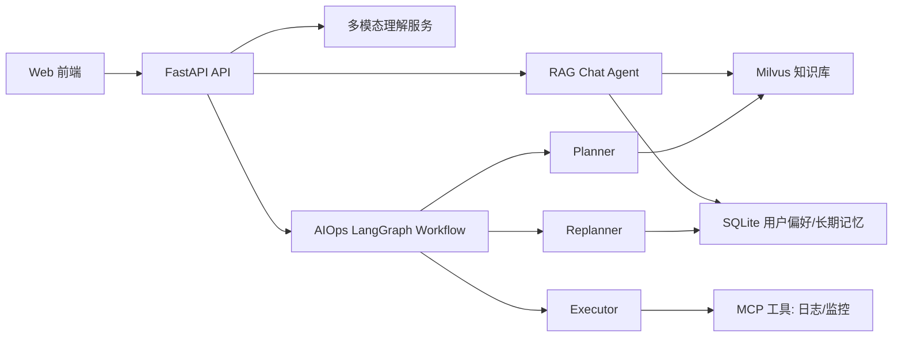
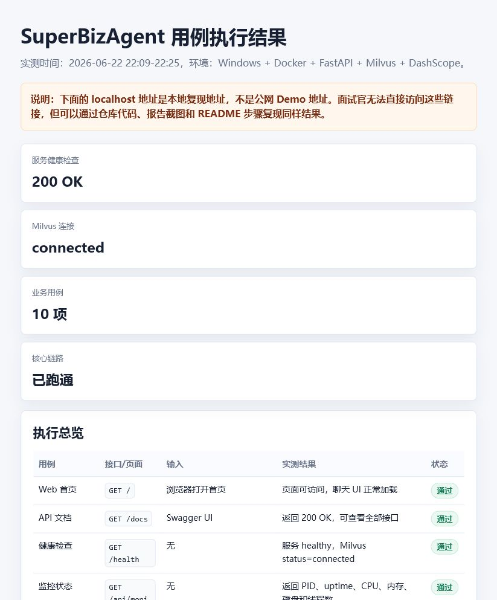
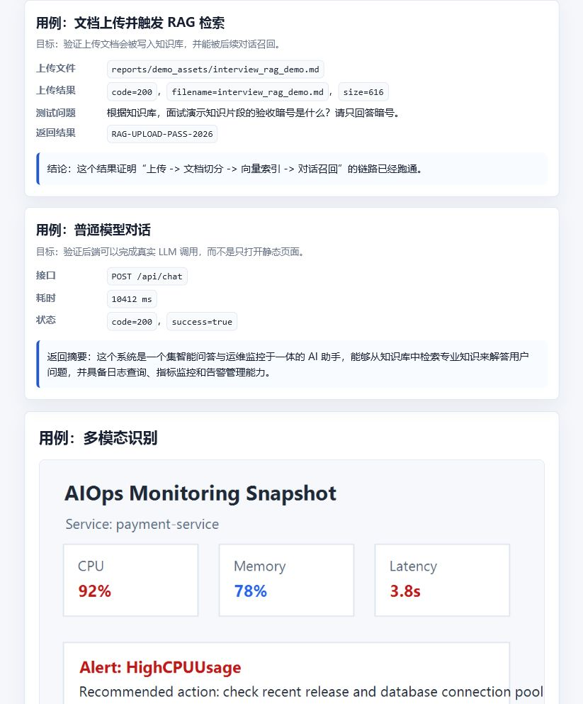
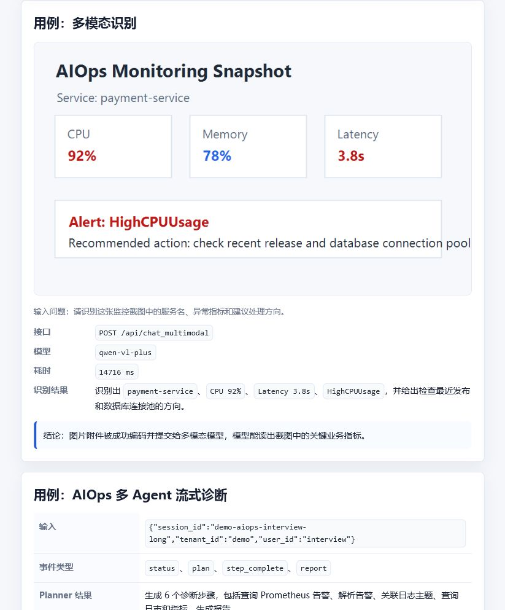
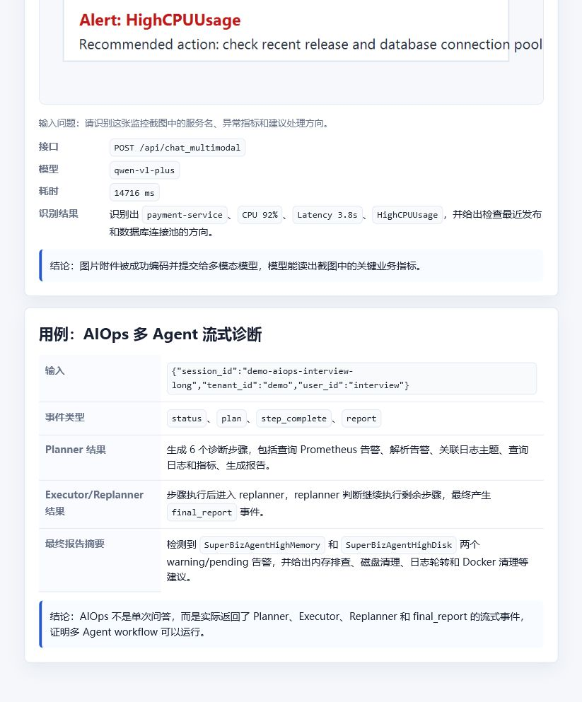

# SuperBizAgent 项目展示报告

## 1. 项目一句话介绍

SuperBizAgent 是一个面向企业智能运维场景的 AI Agent 系统，支持普通对话、RAG 知识库问答、多模态截图识别、AIOps 自动诊断、监控状态查询和长期记忆沉淀。

项目核心不是一个静态聊天页面，而是一个由 FastAPI 后端、LangChain/LangGraph Agent、Milvus 向量数据库、DashScope 大模型、MCP 工具服务和前端页面组成的完整闭环。

## 2. 我主要负责了什么

我主要负责把项目从“能调用模型”完善成“能展示完整业务链路”的 Agent 应用，重点工作包括：

| 模块 | 我完成的内容 |
|---|---|
| RAG 问答 | 接入知识库检索工具，让普通对话可以按需检索 Milvus 中的文档 |
| 文档上传 | 支持 Markdown/TXT 上传、切分、索引，并写入 Milvus |
| 多模态识别 | 支持图片、截图和文本附件，调用 `qwen-vl-plus` 输出结构化分析 |
| AIOps 工作流 | 基于 Planner、Executor、Replanner 实现多 Agent 诊断流程 |
| 失败重试 | 为 planner/executor/replanner 增加失败分支和最多 2 次额外重试 |
| 状态与记忆 | 梳理短期状态、前端 localStorage、SQLite 长期记忆和 Milvus 向量记忆 |
| 监控展示 | 增加健康检查、系统状态、错误日志和 Prometheus 指标验证 |
| 开源整理 | 清理隐私文件，新增 `.env.example`、`.gitignore` 和展示报告 |

## 3. 系统架构



系统分层：

- 前端：聊天页面、附件上传、历史记录、智能运维触发。
- FastAPI：统一提供 `/api/chat`、`/api/upload`、`/api/chat_multimodal`、`/api/aiops`、`/health`、`/metrics` 等接口。
- RAG Agent：根据用户问题决定是否调用知识库工具。
- 多模态服务：把图片转成 data URL，把文本附件解码截断，再交给视觉语言模型。
- AIOps Workflow：Planner 制定计划，Executor 执行步骤，Replanner 判断继续、重规划或生成报告。
- 存储层：Milvus 保存向量知识库，SQLite 保存结构化长期记忆，浏览器 localStorage 保存前端历史。

## 4. 多 Agent 如何分工、通信和终止

AIOps 部分使用的是 Plan-Execute-Replan 模式，不是三个 Agent 直接互相聊天，而是通过共享状态通信。

| Agent/节点 | 主要职责 | 输入 | 输出 |
|---|---|---|---|
| Planner | 根据任务、工具列表、知识库经验生成诊断步骤 | 用户任务、历史案例、工具描述 | `plan` |
| Executor | 每次执行当前计划中的一个步骤，可调用日志/监控/知识库工具 | `plan[0]`、`past_steps` | 当前步骤执行结果 |
| Replanner | 根据已执行结果判断下一步：继续、改计划或生成报告 | `past_steps`、剩余 `plan` | 新计划或 `response` |

共享状态大致如下：

```python
{
    "input": "原始诊断任务",
    "plan": ["待执行步骤1", "待执行步骤2"],
    "past_steps": [("已执行步骤", "执行结果")],
    "response": "最终诊断报告",
    "retry_counts": {"planner": 0, "executor": 0, "replanner": 0}
}
```

终止条件：

- Replanner 判断信息足够时生成 `response`，workflow 结束。
- 如果还有剩余计划，则回到 Executor 继续执行。
- 如果节点失败，会进入对应 retry 分支；重试耗尽后按降级规则继续，避免整个流程卡死。

## 5. 失败重试机制

我加入的失败分支规则如下：

| 节点 | 失败处理 |
|---|---|
| Planner | 最多额外重试 2 次；耗尽后使用默认计划继续 |
| Executor | 最多额外重试 2 次；重试期间不移除当前步骤 |
| Executor 耗尽 | 把该步骤失败结果写入 `past_steps`，然后进入 Replanner |
| Replanner | 最多额外重试 2 次；耗尽后保留原计划继续执行 |

Planner 的默认计划是：

```text
1. 收集相关信息
2. 分析数据
3. 生成报告
```

Executor 失败后记录到 `past_steps` 的用途是：让 Replanner 和最终报告知道“哪个步骤失败了、失败原因是什么”，后续可以决定跳过、换工具、补充计划，最终报告也能如实说明限制。

## 6. 系统是否跑通

系统已经在本地完成端到端验证，结论是：核心链路已跑通。

注意：报告中的 `localhost` 地址只是本地复现地址，不是公网 Demo。别人不能直接访问我的本机端口；面试展示时应使用下面的截图和测试结果作为证据。如果要让别人直接在线访问，需要再部署到云服务器或 PaaS，并绑定公网域名。

本地运行结果：

- FastAPI 服务正常启动。
- `/health` 返回 `200 OK`。
- Milvus 连接状态为 `connected`。
- Docker 中 Prometheus、Attu、Milvus standalone、etcd、MinIO 均在运行。
- Swagger API 文档可打开。
- 普通模型对话可返回结果。
- 文档上传和 RAG 召回可跑通。
- 多模态接口可识别监控截图。
- AIOps workflow 可返回 `status`、`plan`、`step_complete`、`report` 流式事件。

## 7. 评测与运行结果

当前评测方式是端到端功能验证，不是大规模离线 benchmark。测试目标是证明每条核心链路真实可用。

| 用例 | 结果 |
|---|---|
| Web 首页 | 页面可访问，聊天 UI 正常加载 |
| API 文档 | `/docs` 返回 200 OK |
| 健康检查 | `/health` 返回 healthy，Milvus connected |
| 监控状态 | 返回 PID、uptime、CPU、内存、磁盘和线程数 |
| Prometheus 指标 | `/metrics` 返回 Prometheus 文本指标 |
| 普通对话 | `/api/chat` 返回模型回答，success=true |
| 文档上传 | `/api/upload` 上传测试 Markdown 成功 |
| RAG 召回 | 对话准确回答上传文档中的 `RAG-UPLOAD-PASS-2026` |
| 多模态识别 | 识别出截图中的 `payment-service`、CPU 92%、HighCPUUsage |
| AIOps 诊断 | 返回 Planner/Executor/Replanner 过程事件，并生成最终诊断报告 |

### 7.1 运行结果总览



### 7.2 RAG 上传与召回结果



### 7.3 多模态识别结果



### 7.4 AIOps 流式诊断结果



### 7.5 页面和 API 文档


## 8. 面试时可以这样介绍

这是我做的一个智能运维 Agent 项目。它不是单纯的聊天 UI，而是把 RAG 知识库、多模态截图识别、监控指标、日志工具和多 Agent 诊断工作流整合在一起。

我主要负责后端 Agent 能力和工程闭环：包括文档上传后写入 Milvus、普通对话按需检索知识库、多模态接口识别运维截图、AIOps 使用 Planner/Executor/Replanner 进行自动诊断，并为三个核心节点补了失败重试和降级逻辑。

系统已经本地跑通。我做了端到端用例验证：健康检查、监控接口、Prometheus 指标、普通对话、文档上传、RAG 召回、多模态识别和 AIOps 流式诊断都能返回实际结果。当前评测主要是功能性验证，截图和测试结果已经放在 `reports/` 目录，便于展示和复现。

## 9. 后续可以继续优化

- 部署到公网服务器，提供可直接访问的在线 Demo。
- 增加自动化测试脚本，把这些用例做成 CI 检查。
- 为 RAG 和 AIOps 设计更系统的离线评测集。
- 增加更多真实日志源和监控数据源，提升诊断覆盖面。
