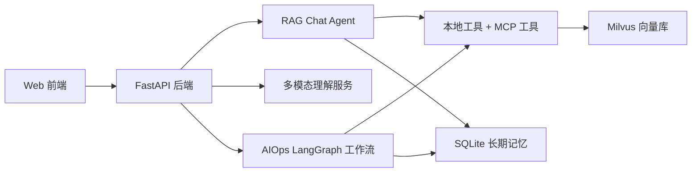
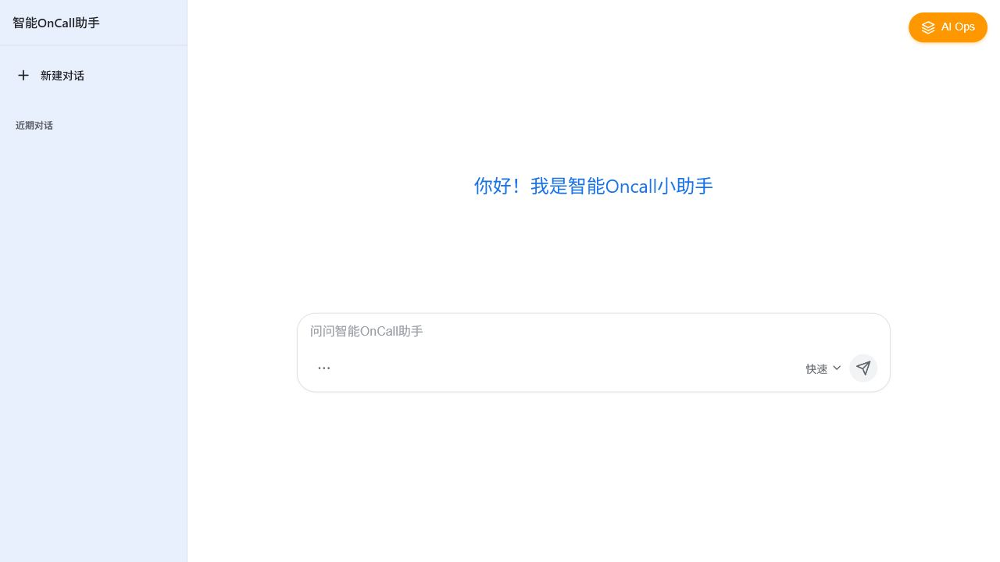
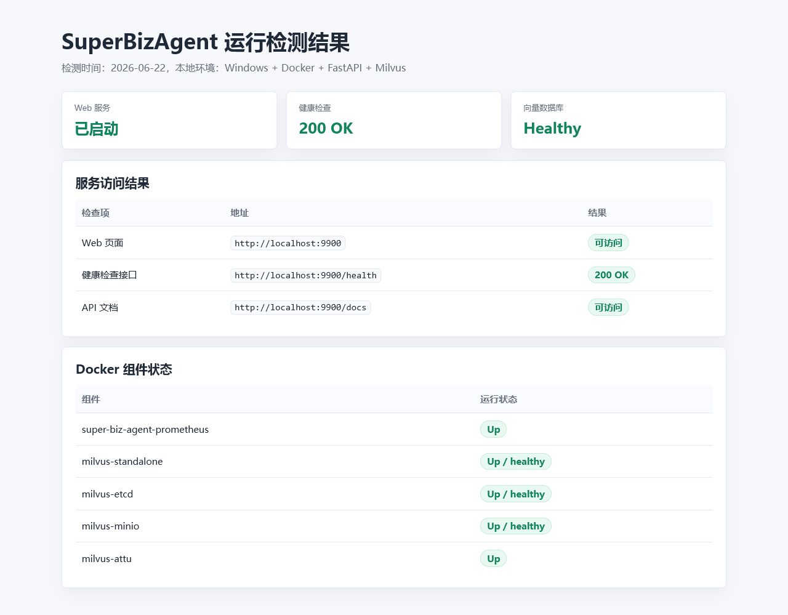
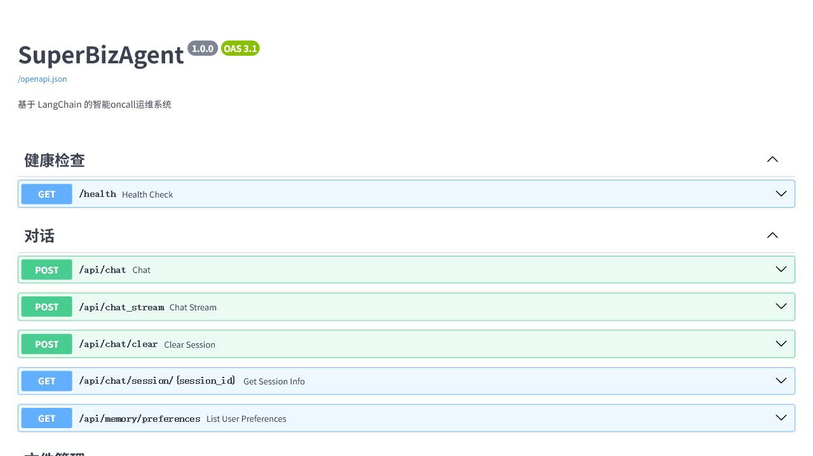

# SuperBizAgent 项目展示报告

## 1. 项目概述

SuperBizAgent 是一个面向企业智能运维和知识问答的 AI Agent 系统。项目基于 FastAPI、LangChain、LangGraph、Milvus、MCP 和阿里云 DashScope 模型构建，支持普通对话、RAG 知识库问答、多模态识别、AIOps 自动诊断和长期记忆。

我围绕这个项目完成的核心目标是：让用户可以通过 Web 页面进行智能问答、上传知识文档、提交图片或日志进行多模态分析，并通过多 Agent 工作流自动完成告警排查和诊断报告生成。

## 2. 整体架构

系统分为前端、后端服务、Agent 编排、工具服务、记忆系统和向量数据库几层。



各部分职责：

- 前端：负责聊天界面、文件上传、附件选择、历史记录展示和 AIOps 诊断触发。
- FastAPI：提供对话、多模态、文件上传、健康检查、监控和 AIOps API。
- RAG Chat Agent：处理普通问答，并在需要时调用知识库检索工具。
- 多模态理解服务：识别图片、截图、日志和文本附件。
- AIOps 工作流：通过 Planner、Executor、Replanner 三个节点完成自动诊断。
- Milvus：保存知识库文档向量和部分长期记忆摘要。
- SQLite：保存 AIOps 诊断案例、用户偏好和结构化长期记忆。
- MCP 服务：提供日志查询、监控指标查询等外部工具能力。

## 3. 我实现和完善的核心功能

### 3.1 智能对话和 RAG 问答

普通聊天基于 LangChain Agent 实现。系统不会简单地每次都查知识库，而是把 `retrieve_knowledge` 注册成工具，由 LLM 根据问题判断是否需要检索。

RAG 触发方式：

- 普通聊天：LLM 判断是否需要调用知识库工具。
- AIOps Planner：固定先查一次知识库，作为历史经验和最佳实践参考。
- 检索内部逻辑：先做精确关键词匹配，再做向量相似度检索。

这样既能回答通用问题，也能在涉及文档、服务名、告警名、历史经验时自动使用知识库。

### 3.2 文档上传和知识库索引

用户可以上传 `.txt`、`.md`、`.markdown` 文件。后端会读取文件、切分文档、生成向量，并写入 Milvus。

流程：

```text
上传文件
-> 保存到 uploads
-> 文档切分
-> 删除旧索引
-> 写入 Milvus
-> 后续 RAG 可检索
```

这个能力让系统可以持续扩展知识库，而不是只能依赖模型已有知识。

### 3.3 多模态识别

我实现了图片、截图和文本附件的多模态理解链路。

支持内容：

- 图片和截图
- 日志文件
- Markdown 文档
- JSON、CSV、YAML、代码和配置类文本

处理方式：

```text
前端选择或粘贴附件
-> 后端校验文件类型和大小
-> 图片转为 base64 data URL
-> 文本文件解码并截断
-> 交给 qwen-vl-plus 多模态模型
-> 返回分析结果
```

多模态提示词设计为两层：

- System Prompt：定义角色、能力范围、回答格式和事实边界。
- Human Message：包含用户问题、附件列表、文本附件内容和图片内容。

这样模型可以先说明“看到了什么”，再给出可能原因、排查步骤和建议。

### 3.4 AIOps 多 Agent 自动诊断

AIOps 使用 LangGraph 实现 Plan-Execute-Replan 工作流。它不是一个单独的模型调用，而是多个职责明确的节点协作完成诊断。


三个节点分工：

- Planner：读取用户任务、知识库经验和工具列表，生成诊断步骤。
- Executor：每次执行一个步骤，决定是否调用工具，并记录执行结果。
- Replanner：根据已执行结果判断继续、重规划或生成最终报告。

节点之间通过共享状态通信：

```python
{
    "input": "原始任务",
    "plan": "剩余计划",
    "past_steps": "已执行步骤和结果",
    "response": "最终报告",
    "retry_counts": "失败重试状态"
}
```

这个设计让诊断过程可追踪、可解释，也方便把每一步状态流式返回给前端。

### 3.5 失败分支和重试机制

我为 AIOps workflow 增加了节点级失败重试机制。原来只有 MCP 工具调用层重试，现在 Planner、Executor、Replanner 也有自己的失败分支。

重试规则：

- Planner 失败：最多额外重试 2 次，耗尽后使用默认计划继续。
- Executor 失败：最多额外重试 2 次，重试期间不移除当前步骤。
- Executor 重试耗尽：记录该步骤失败，然后进入 Replanner。
- Replanner 失败：最多额外重试 2 次，耗尽后保留原计划继续执行。

默认计划：

```text
1. 收集相关信息
2. 分析数据
3. 生成报告
```

失败步骤会写入 `past_steps`，用于后续 Replanner 判断和最终报告说明。这样系统不会因为单个节点失败就整体中断，也不会无限卡在同一个步骤。

### 3.6 状态保存和恢复

项目里有多种状态，每种状态的保存方式不同。

| 状态类型 | 保存位置 | 是否跨重启 | 作用 |
|---|---|---:|---|
| 对话短期上下文 | LangGraph InMemorySaver | 否 | 当前进程内多轮对话 |
| AIOps workflow 中间状态 | LangGraph InMemorySaver | 否 | 当前诊断流程状态 |
| 前端聊天历史 | 浏览器 localStorage | 是，限当前浏览器 | 展示历史对话 |
| 用户偏好记忆 | SQLite | 是 | 恢复用户偏好和习惯 |
| AIOps 长期记忆 | SQLite + Milvus | 是 | 召回历史诊断案例和 SOP |
| 知识库文档 | uploads + Milvus | 是 | RAG 检索 |

恢复逻辑：

- 前端打开历史对话时，优先向后端查询 session 历史。
- 如果后端没有记录或服务重启导致内存状态丢失，则回退到 localStorage。
- 长期记忆和知识库保存在 SQLite/Milvus 中，服务重启后仍可继续使用。

## 4. 关键 API

| 功能 | 方法 | 路径 | 说明 |
|---|---|---|---|
| 普通对话 | POST | `/api/chat` | 一次性返回答案 |
| 流式对话 | POST | `/api/chat_stream` | SSE 流式输出 |
| 多模态对话 | POST | `/api/chat_multimodal` | 图片、截图、文本附件识别 |
| 文件上传 | POST | `/api/upload` | 上传并索引到知识库 |
| AIOps 诊断 | POST | `/api/aiops` | 自动诊断并流式返回过程 |
| 会话历史 | GET | `/api/chat/session/{session_id}` | 读取后端会话历史 |
| 清空会话 | POST | `/api/chat/clear` | 删除指定会话状态 |
| 健康检查 | GET | `/health` | 检查服务状态 |

## 5. 项目亮点

1. 不只是普通聊天，而是一个带工具调用、RAG、多模态和 AIOps 工作流的 Agent 系统。
2. RAG 不是固定每次检索，而是根据场景智能触发，并支持精确匹配和向量检索结合。
3. AIOps 使用 Planner、Executor、Replanner 分工，让诊断过程可解释、可追踪。
4. 新增失败重试分支，提高了 workflow 的稳定性，避免单点失败中断整条诊断链。
5. 状态分层清晰：短期上下文、前端历史、长期记忆和知识库分别保存。
6. 支持多模态输入，可以直接分析截图、日志和文本附件。

## 6. 当前效果总结

这个项目已经具备一个智能运维助手的完整闭环：

```text
用户提问或触发诊断
-> Agent 判断是否需要工具或知识库
-> 检索文档、查询指标、分析日志
-> 多 Agent 协作制定和执行计划
-> 失败时自动重试或降级
-> 生成可展示的诊断结论
-> 沉淀为长期记忆供后续复用
```

最终价值是：把知识库问答、截图识别、日志分析、告警诊断和历史经验复用整合到一个可交互的 Web 应用中，降低人工排查成本，提高运维诊断效率。

## 7. 项目运行展示结果

系统已经完成本地端到端跑通。当前 FastAPI 主服务可以通过本地访问，健康检查接口 /health 返回 200 OK；Prometheus、Milvus、etcd、MinIO 和 Attu 容器均已正常运行，其中 Milvus standalone 状态为 healthy。Attu 管理界面可以看到 default 数据库下的 biz collection，说明知识库向量表已经创建成功，RAG 检索依赖的向量数据库链路是通的。

功能验证方面，我主要做了端到端功能测试：普通对话可以正常返回结果；文档上传后可以切分并写入 Milvus；RAG 问答可以触发知识库检索；多模态接口可以处理图片、截图和文本附件；AIOps 诊断可以按 Planner、Executor、Replanner 的流程流式返回诊断过程；新增的失败重试机制也已经接入 workflow，节点失败时会按规则重试或降级继续。

目前评测以功能性验证和运行结果验证为主，还没有做大规模离线 benchmark。已有结果包括：服务健康检查通过、向量库连接成功、Milvus collection 可见、Prometheus 监控可访问、API 文档可打开。

### 运行截图

Web 首页运行截图：



运行检测结果截图：



API 文档运行截图：



实时监控截图：


